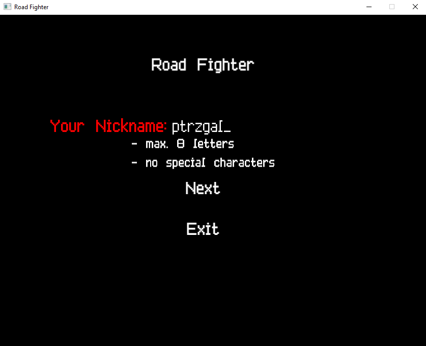
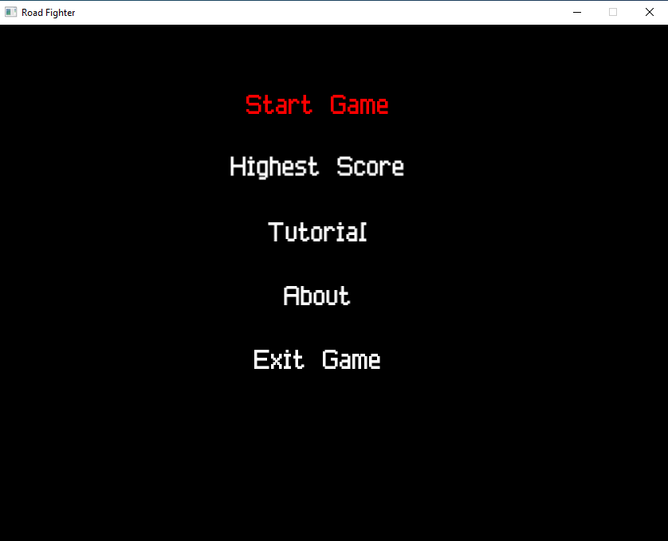
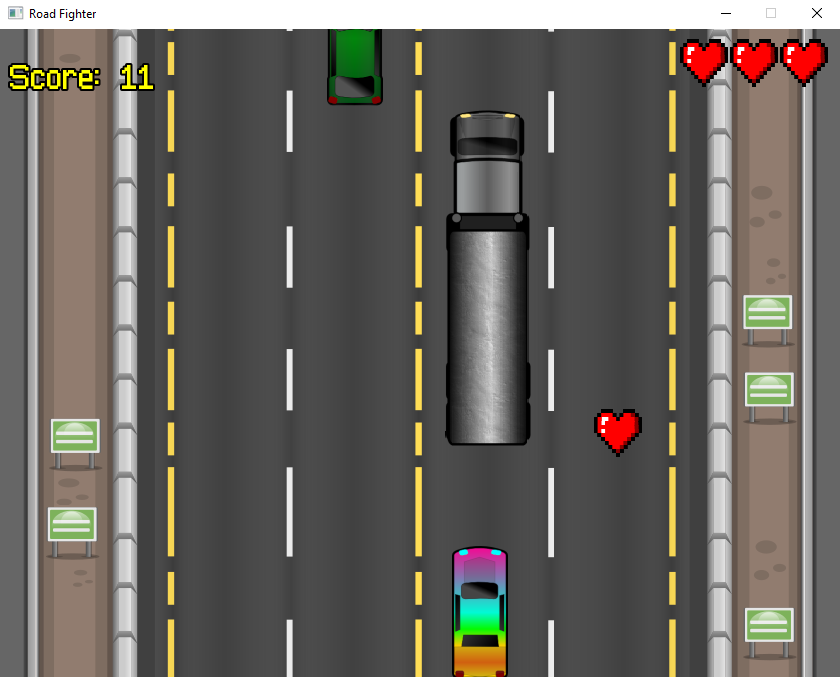
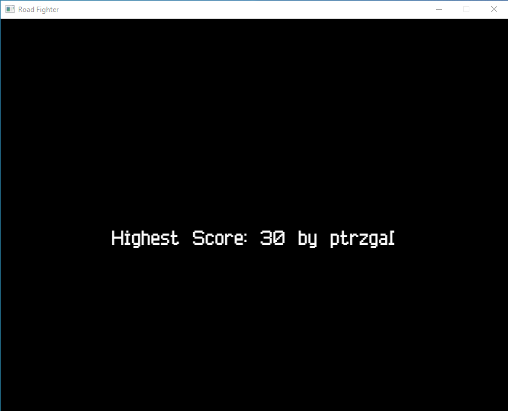

# Road Fighter

Dynamic and engaging arcade game where you race on a highway, avoiding collisions and achieving the highest possible score. Built as part of a programming course at Silesian University of Technology.

## Table of Contents
- [About the Game](#about-the-game)
- [Features](#features)
- [Screenshots](#screenshots)
- [Technologies Used](#technologies-used)
- [Setup and Usage](#setup-and-usage)
- [Gameplay](#gameplay)
- [Future Possible Enhancements](#future-possible-enhancements)

## About the Game
Road Fighter is an arcade game where the player controls a car, navigating through a highway while avoiding collisions with other vehicles and obstacles. The goal is to survive as long as possible and achieve the highest score.

## Features
- **Dynamic Gameplay**: Intuitive controls and responsive mechanics.
- **Power-ups**: Special icons to increase lives.
- **Highest Score Tracker**: Keeps track of the best player and score.
- **Multiple Game States**:
  - Start Menu
  - Tutorial
  - Gameplay
  - Game Over Menu
- **Custom Nickname Entry**: Players can personalize their experience.

## Screenshots

### 1. Nickname Entry Menu
Players can enter their nickname to personalize their experience.

### 2. Main Menu
The main menu allows players to start the game, view the highest score, access the tutorial, or exit.

### 3. Gameplay
Navigate through the highway, avoiding cars and collecting power-ups.

### 4. Highest Score Screen
Displays the highest score achieved by any player.

## Technologies Used
- **Programming Language**: C++
- **Libraries**:
  - [SFML](https://www.sfml-dev.org/) for graphics and sound.
  - [nlohmann::json](https://github.com/nlohmann/json) for handling data storage.
- **Development Features**:
  - Modern C++ standards, including `<filesystem>` and `<ranges>`.
  - Modular programming and polymorphism.

## Setup and Usage
1. Clone this repository or download the game files.
2. Ensure you have all required dependencies installed, including SFML and JSON library.
3. Compile the source code or use the provided `Road-Fighter.exe`.
4. Run the game:
   - Open the executable.
   - Follow the on-screen instructions to enter your nickname and navigate the menus.

## Gameplay
- Navigate through the highway using arrow keys.
- Avoid collisions with enemy cars.
- Collect power-ups to gain extra lives.
- Strive to beat the highest score!

### Game Controls
- **Arrow Keys**: Navigate through menus and control the car.
- **Enter**: Confirm selections.
- **Escape**: Exit menus or quit the game.

## Future Possible Enhancements
- Difficulty scaling as the game progresses.
- Additional power-ups for varied gameplay mechanics.
- Enhanced graphics and animations.
